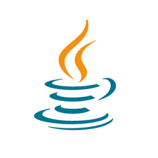

# ☕ Java Overview

Java is a high-level, object-oriented programming language and platform used to build a wide range of software—from web applications to mobile apps and enterprise systems.

It was originally developed by Sun Microsystems and is now maintained by Oracle Corporation.

---

---

##  Key Characteristics

###  Object-Oriented (OOP)
Programs are structured around objects and classes, making code reusable and modular.

###  Platform-Independent (“Write Once, Run Anywhere”)
Java code is compiled into bytecode, which runs on the Java Virtual Machine (JVM). That means the same program can run on Windows, macOS, Linux, etc.

###  Robust & Secure
Includes features like memory management and exception handling.

###  Widely Used
Powers backend systems, Android apps, desktop tools, and large-scale enterprise platforms.

---

## Summary

Java is a powerful and versatile programming language used across many industries due to its reliability, security, and cross-platform capabilities.